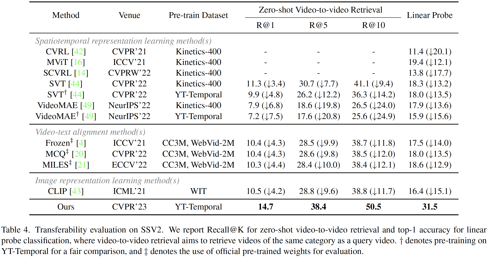
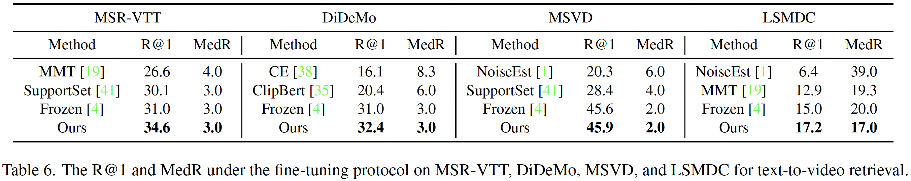

# [CVPR 2023] Learning Transferable Spatiotemporal Representations from Natural Script Knowledge

> Ziyun Zeng\*, Yuying Ge\*, Xihui Liu, Bin Chen, Ping Luo, Shu-Tao Xia, Yixiao Ge

This repo is the official implementation of the paper [Learning Transferable Spatiotemporal Representations from Natural Script Knowledge](https://arxiv.org/abs/2209.15280).


## News

+ **[2023.02]** Our paper is accepted to CVPR 2023.
+ **[2023.03]** The official code is released.

## Main Results

### Transferability Evaluation



### Action Recognition


### Text-to-Video Retrieval



## Instruction

### Dataset Preparation

#### Pre-training Datasets

1. Download YT-Temporal from [here](https://rowanzellers.com/merlot), and put the dataset under the folder  `data/YTTemporal`.
2. Download WebVid-2M from [here](https://github.com/m-bain/webvid), and put the dataset under the folder `data/WebVid`.
3. Download CC3M from [here](https://ai.google.com/research/ConceptualCaptions/download), and put the dataset under the folder `data/CC3M`.
4. Download the split file from [here](https://drive.google.com/file/d/1Y2-CkRVymrORUrSE2whcf3i9hKa2NbcP/view?usp=sharing), and unzip it in the root directory.

#### Downstream Datasets

1. Download SSV2 from [here](https://developer.qualcomm.com/software/ai-datasets/something-something), and put the dataset under the folder `data/SSV2`.

### Training and Evaluation

We use 32 NVIDIA V100 GPUs for pre-training and downstream evaluation. The detailed hyper-parameters can be found in the Appendix.

#### Pre-training

1. Run the following script to pre-train the model on the YT-Temporal dataset. You need to download the official [ImageMAE-Base](https://dl.fbaipublicfiles.com/mae/pretrain/mae_pretrain_vit_base.pth) weights for initialization.

   ```bash
   bash scripts/train_yt.sh
   ```

2. Run the following script to jointly post-pretrain the model on the CC3M and WebVid-2M datasets. Note that you need to specify the variable “load_checkpoint” in `configs/dist-cc-web-pt.json` to the checkpoint path of the YT-Temporal pre-trained model.

   ```bash
   bash scripts/train_cc_web.sh
   ```

#### Downstream Evaluation

We have released our pre-trained model on Google Drive in the following links to quickly reproduce the results reported in our paper.

1. YT-Temporal: https://drive.google.com/file/d/1JthEHg1ETHp5phHzjuhR1H8SfBlousYD/view?usp=sharing
2. YT-Temporal + CC3M + WebVid-2M: https://drive.google.com/file/d/19WOHhJZfDtqLvzK_g_Kwr6om1hoMowMe/view?usp=sharing

Run the following scripts to evaluate different tasks on the SSV2 dataset.

1. Zero-shot Video Retrieval (Only supports single GPU evaluation currently)

   ```bash
   bash scripts/zero_ssv2.sh
   ```

2. Linear Probe (About 7-8 hours on 32 NVIDIA V100 GPUs)

   ```bash
   bash scripts/linear_ssv2.sh
   ```

3. Fine-tuning (About 7-8 hours on 32 NVIDIA V100 GPUs)

   ````bash
   bash scripts/ft_ssv2.sh
   ````

### Acknowledgement

+ The pre-training code is based on the official implementation of [Frozen in Time: A Joint Video and Image Encoder for End-to-End Retrieval](https://github.com/m-bain/frozen-in-time).

+ The downstream evaluation code is based on the official implementation of [VideoMAE: Masked Autoencoders are Data-Efficient Learners for Self-Supervised Video Pre-Training](https://github.com/MCG-NJU/VideoMAE).

### Citation

If you find our work helps, please cite our paper.

```tex
@article{zeng2022learning,
  title={Learning Transferable Spatiotemporal Representations from Natural Script Knowledge},
  author={Zeng, Ziyun and Ge, Yuying and Liu, Xihui and Chen, Bin and Luo, Ping and Xia, Shu-Tao and Ge, Yixiao},
  journal={arXiv preprint arXiv:2209.15280},
  year={2022}
}
```

### License

This research paper makes references to some open-source projects. Credits are given to these projects. See [License.txt](License.txt) for details.


