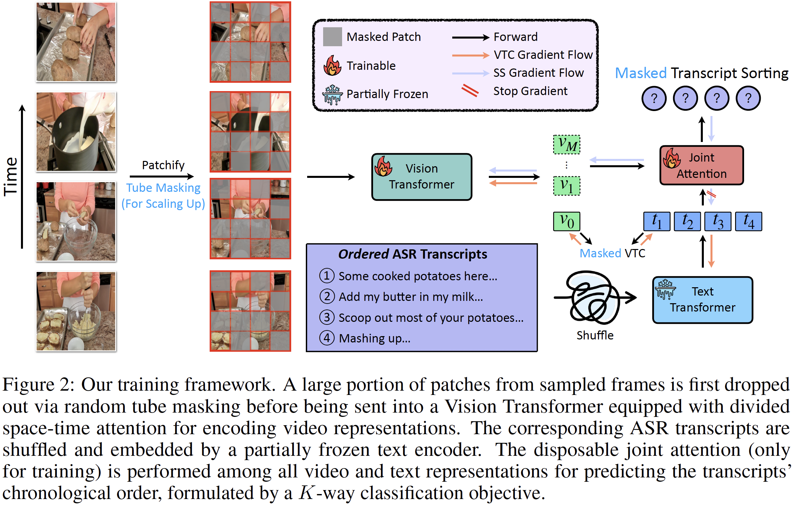
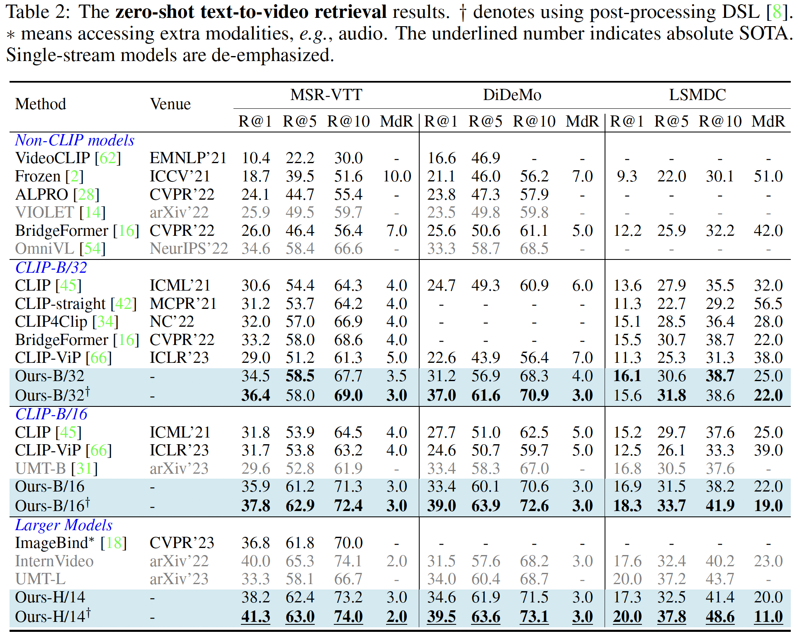
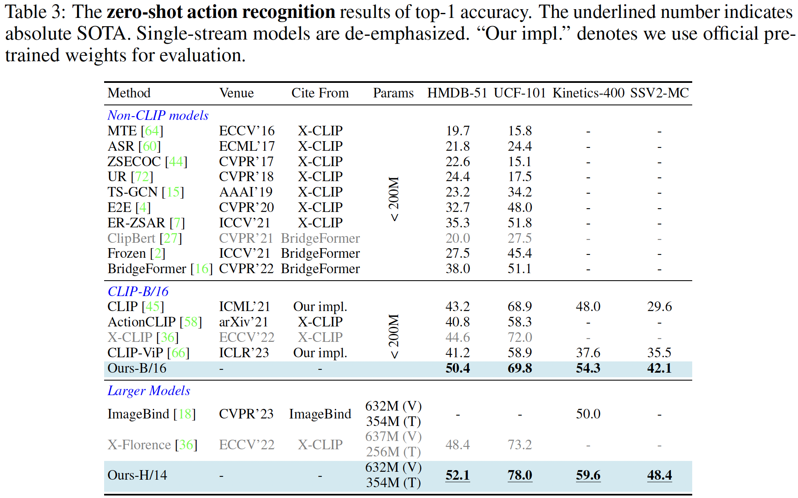
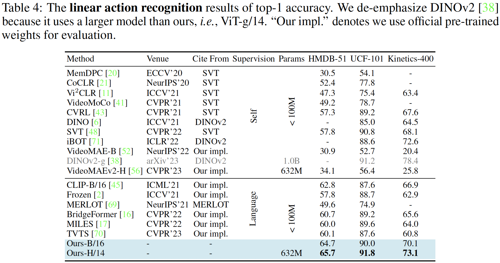

# [Technical Report] TVTSv2: Learning Out-of-the-box Spatiotemporal Visual Representations at Scale

> Ziyun Zeng, Yixiao Ge, Zhan Tong, Xihui Liu, Shu-Tao Xia, Ying Shan

This repo is the official implementation of the paper [TVTSv2: Learning Out-of-the-box Spatiotemporal Visual Representations at Scale](https://arxiv.org/abs/2305.14173).



## Main Results

### Zero-shot Text-to-Video Retrieval



### Zero-shot Action Recognition



### Linear Probe



## Instruction

### Environment Setup

Before you start, run the following command to set up your Python environment.

```bash
pip install -r requirement.txt
```

### Dataset Preparation

#### Dataset Splits

We have uploaded the dataset splits on Google Drive. Download it from [this link](https://drive.google.com/file/d/1EOdB1MmPUHvHDW2le7WbAC1fbDV6LOTM/view?usp=sharing) and unzip it in the root directory.

#### Pre-training Datasets

1. Download YT-Temporal from [here](https://rowanzellers.com/merlot/), and put the dataset under the folder  `data/YTTemporal`.
2. Download WebVid-2M from [here](https://github.com/m-bain/webvid), and put the dataset under the folder `data/WebVid`.

#### Downstream Datasets

###### Text-to-Video Retrieval

1. Download MSR-VTT from [here](https://www.kaggle.com/datasets/vishnutheepb/msrvtt), and put the dataset under the folder `data/msrvtt`.
2. Download DiDeMo from [here](https://github.com/LisaAnne/TemporalLanguageRelease), and put the dataset under the folder `data/didemo`.
3. Download LSMDC from [here](https://sites.google.com/site/describingmovies), and put the dataset under the folder `data/lsmdc`.

###### Action Recognition

1. Download HMDB-51 from [here](https://serre-lab.clps.brown.edu/resource/hmdb-a-large-human-motion-database/), and put the dataset under the folder `data/hmdb51`.
2. Download UCF-101 from [here](https://www.crcv.ucf.edu/research/data-sets/ucf101/), and put the dataset under the folder `data/ucf101`.
3. Download Kinetics-400 from [here](https://github.com/cvdfoundation/kinetics-dataset), and put the dataset under the folder `data/k400`.
4. Download SSV2 from [here](https://developer.qualcomm.com/software/ai-datasets/something-something), and put the dataset under the folder `data/SSV2`.

### Training and Evaluation

We use up to 80 NVIDIA V100 GPUs for pre-training. The detailed hyper-parameters can be found in the Appendix.

#### Pre-training

1. Download CLIP-B/32 and CLIP-B/16 weights from [OpenAI’s official repo](https://github.com/openai/CLIP), and put them into `CLIP/models`.

2. Download OpenCLIP-H/14 weights from [the official repo](https://github.com/mlfoundations/open_clip), and put it into `OpenCLIP/models`.

3. Run the following script to pre-train different models on the YT-Temporal dataset and WebVid dataset jointly. 

   ```bash
   bash scripts/train_dist_TVTSv2_ViT_B_32.sh # for ViT-B/32, no mask
   bash scripts/train_dist_TVTSv2_ViT_B_16.sh # for ViT-B/16, mask 50%
   bash scripts/train_dist_TVTSv2_ViT_H_14.sh # for ViT-H/14, mask 70%
   ```

#### Downstream Evaluation

We have released our pre-trained models on Google Drive in the following links to quickly reproduce the results reported in our paper.

1. TVTSv2_B_32: https://drive.google.com/file/d/1zNHgqioo-aRUwZXPyTDiRT2uaRrnk386/view?usp=sharing
2. TVTSv2_B_16: https://drive.google.com/file/d/1HKc7aGwMd5jhVaYztuY-jbmYqiz_wvWF/view?usp=sharing
3. TVTSv2_H_14: https://drive.google.com/file/d/1nxNSaQKm2jt9NSZ3eLnKx7ATTumV-6D5/view?usp=sharing

Download the pre-trained models and put them in the root directory. All zero-shot evaluation scripts are available on a single GPU. Try our powerful models now 😎!

```bash
# MSR-VTT Zero-shot Text-to-Video Retrieval
bash scripts/zero_ret_msrvtt_TVTSv2_ViT_B_32.sh # for ViT-B/32
bash scripts/zero_ret_msrvtt_TVTSv2_ViT_B_16.sh # for ViT-B/16
bash scripts/zero_ret_msrvtt_TVTSv2_ViT_H_14.sh # for ViT-H/14
```

```bash
# DiDeMo Zero-shot Text-to-Video Retrieval
bash scripts/zero_ret_didemo_TVTSv2_ViT_B_32.sh # for ViT-B/32
bash scripts/zero_ret_didemo_TVTSv2_ViT_B_16.sh # for ViT-B/16
bash scripts/zero_ret_didemo_TVTSv2_ViT_H_14.sh # for ViT-H/14
```

```bash
# LSMDC Zero-shot Text-to-Video Retrieval
bash scripts/zero_ret_lsmdc_TVTSv2_ViT_B_32.sh # for ViT-B/32
bash scripts/zero_ret_lsmdc_TVTSv2_ViT_B_16.sh # for ViT-B/16
bash scripts/zero_ret_lsmdc_TVTSv2_ViT_H_14.sh # for ViT-H/14
```

```bash
# HMDB-51 Zero-shot Action Recognition
bash scripts/zero_recognition_hmdb51_TVTSv2_ViT_B_32.sh # for ViT-B/32
bash scripts/zero_recognition_hmdb51_TVTSv2_ViT_B_16.sh # for ViT-B/16
bash scripts/zero_recognition_hmdb51_TVTSv2_ViT_H_14.sh # for ViT-H/14
```

```bash
# UCF-101 Zero-shot Action Recognition
bash scripts/zero_recognition_ucf101_TVTSv2_ViT_B_32.sh # for ViT-B/32
bash scripts/zero_recognition_ucf101_TVTSv2_ViT_B_16.sh # for ViT-B/16
bash scripts/zero_recognition_ucf101_TVTSv2_ViT_H_14.sh # for ViT-H/14
```

```bash
# Kinetics-400 Zero-shot Action Recognition
bash scripts/zero_recognition_k400_TVTSv2_ViT_B_32.sh # for ViT-B/32
bash scripts/zero_recognition_k400_TVTSv2_ViT_B_16.sh # for ViT-B/16
bash scripts/zero_recognition_k400_TVTSv2_ViT_H_14.sh # for ViT-H/14
```

```bash
# SSV2-MC Zero-shot Action Recognition
bash scripts/zero_ssv2_mc_TVTSv2_ViT_B_32.sh # for ViT-B/32
bash scripts/zero_ssv2_mc_TVTSv2_ViT_B_16.sh # for ViT-B/16
bash scripts/zero_ssv2_mc_TVTSv2_ViT_H_14.sh # for ViT-H/14
```

**Tips:** The performance may differ slightly (either higher or lower) from our papers due to hardware environment differences.

#### Video Feature Extraction

Our model is able to act as an independent video feature extractor. And we provide simple scripts for out-of-the-box usage. Have a try on your own video😜!

```bash
cd downstream
python feature_extraction_TVTSv2_B_32.py --video_path /path/to/video.mp4 # for ViT-B/32, feature shape: [1 x 512]
python feature_extraction_TVTSv2_B_16.py --video_path /path/to/video.mp4 # for ViT-B/16, feature shape: [1 x 512]
python feature_extraction_TVTSv2_H_14.py --video_path /path/to/video.mp4 # for ViT-H/14, feature shape: [1 x 1024]
```

### Acknowledgement

+ The pre-training code is based on the official implementation of [Frozen in Time: A Joint Video and Image Encoder for End-to-End Retrieval](https://github.com/m-bain/frozen-in-time).

### Citation

If you find our work helps, please cite our paper.

```tex
@misc{zeng2023tvtsv2,
      title={TVTSv2: Learning Out-of-the-box Spatiotemporal Visual Representations at Scale}, 
      author={Ziyun Zeng and Yixiao Ge and Zhan Tong and Xihui Liu and Shu-Tao Xia and Ying Shan},
      year={2023},
      eprint={2305.14173},
      archivePrefix={arXiv},
      primaryClass={cs.CV}
}
```

### License

This research paper makes references to some open-source projects. Credits are given to these projects. See [License.txt](License.txt) for details.

